<p align="center"><a href="README.md">中文</a> · <a href="README.en.md">English</a> · <strong>日本語</strong> · <a href="README.ko.md">한국어</a> · <a href="README.ar.md">العربية</a></p>

<p align="center">
  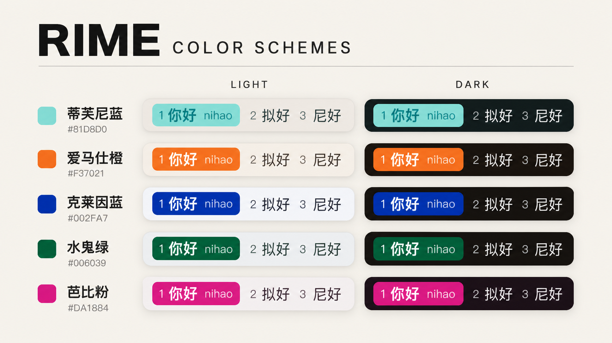
</p>

# XXD Color Schemes for Rime

[鼠鬚管](https://github.com/rime/squirrel) / [小狼毫](https://github.com/rime/weasel) 向けの **選択チップ配色 20 セット**。それぞれライトとナイトがあります。

選択チップは塗り直しません。公開されているブランド HEX を使います。ティファニーの箱 `#81D8D0`、エルメスオレンジ `#F37021`、クラインブルー `#002FA7`、シャネルブラック `#000000`。ライトは紙、ナイトはほぼ黒。MIT。

## テーマプレビュー

20 種類のテーマをライトとナイトで紹介します。まず好みの配色を選び、その後 AI の指示文または手動手順でインストールしてください。

<h3 id="tiffany">ティファニーブルー · <code>#81D8D0</code></h3>

ボックスのロビンエッグブルー。ライトはリネン紙の上。

```yaml
style/color_scheme: xxd_tiffany
style/color_scheme_dark: xxd_tiffany_night
```

<p>
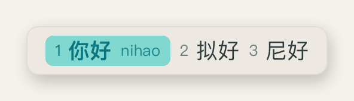
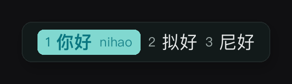
</p>

<h3 id="hermes">エルメスオレンジ · <code>#F37021</code></h3>

リボンオレンジに白文字。サンド紙、エスプレッソの夜。

```yaml
style/color_scheme: xxd_hermes
style/color_scheme_dark: xxd_hermes_night
```

<p>
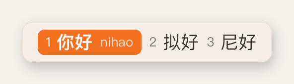
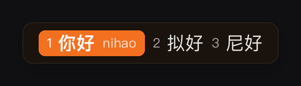
</p>

<h3 id="klein">クラインブルー · <code>#002FA7</code></h3>

IKB を選択チップにそのまま。ナイトは暖色の黒の上で発色。

```yaml
style/color_scheme: xxd_klein
style/color_scheme_dark: xxd_klein_night
```

<p>

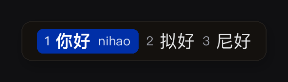
</p>

<h3 id="rolex">サブマリーナーグリーン · <code>#006039</code></h3>

サブマリーナーグリーンにスチールグレー紙。ナイトは暖黒の文字盤。

```yaml
style/color_scheme: xxd_rolex
style/color_scheme_dark: xxd_rolex_night
```

<p>
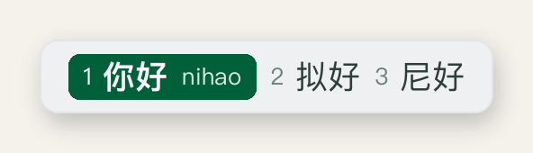
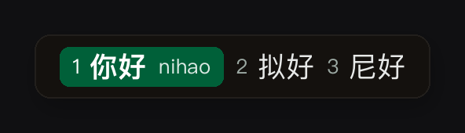
</p>

<h3 id="ferrari">フェラーリレッド · <code>#FF2800</code></h3>

レーシングレッドにショールームホワイト。ナイトはカーボンブラック。

```yaml
style/color_scheme: xxd_ferrari
style/color_scheme_dark: xxd_ferrari_night
```

<p>

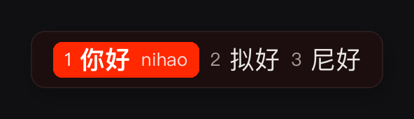
</p>

<h3 id="barbie">バービーピンク · <code>#DA1884</code></h3>

Pantone 219。選択チップは原色のピンク、紙はグレーに抑える。

```yaml
style/color_scheme: xxd_barbie
style/color_scheme_dark: xxd_barbie_night
```

<p>
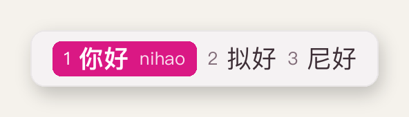
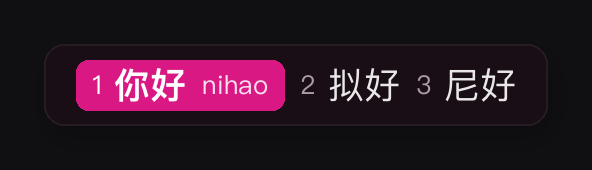
</p>

<h3 id="coke">コカ・コーラレッド · <code>#F40009</code></h3>

広告の赤をクリーム紙に。ナイトは暖色。

```yaml
style/color_scheme: xxd_coke
style/color_scheme_dark: xxd_coke_night
```

<p>
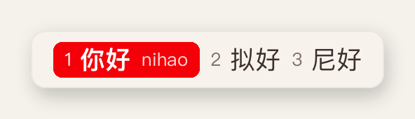

</p>

<h3 id="starbucks">スターバックスグリーン · <code>#00704A</code></h3>

サイレングリーンにコーヒークリーム紙。ナイトはコーヒーブラック。

```yaml
style/color_scheme: xxd_starbucks
style/color_scheme_dark: xxd_starbucks_night
```

<p>
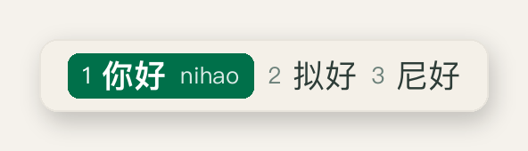
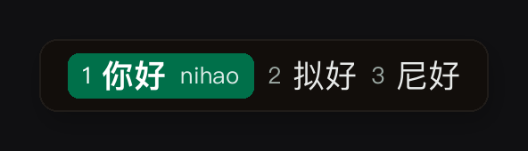
</p>

<h3 id="ikea_blue">イケアブルー · <code>#0058A3</code></h3>

原色の青チップに白文字。コメントにイケアイエローを一点。

```yaml
style/color_scheme: xxd_ikea_blue
style/color_scheme_dark: xxd_ikea_blue_night
```

<p>

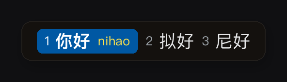
</p>

<h3 id="ikea_yellow">イケアイエロー · <code>#FFDA1A</code></h3>

原色の黄は白紙に沈むので、ライトはネイビーバーで黄チップを支える。文字はイケアブルー。

```yaml
style/color_scheme: xxd_ikea_yellow
style/color_scheme_dark: xxd_ikea_yellow_night
```

<p>
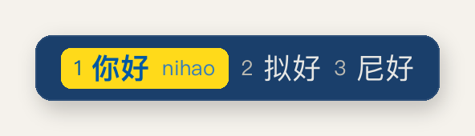
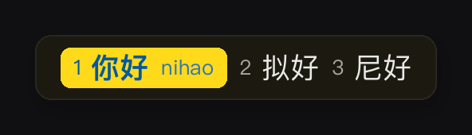
</p>

<h3 id="chanel">シャネルブラック · <code>#000000</code></h3>

アイボリー紙の上の黒チップ。ナイトはチャコールバー、黒チップ、アイボリー文字。

```yaml
style/color_scheme: xxd_chanel
style/color_scheme_dark: xxd_chanel_night
```

<p>
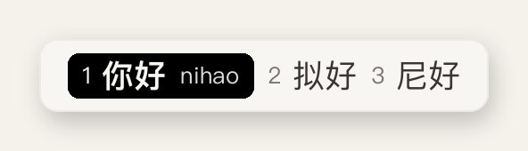
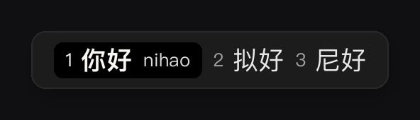
</p>

<h3 id="cartier">カルティエレッド · <code>#D0021B</code></h3>

ジュエリー店のワインレッドをアイボリー紙に。

```yaml
style/color_scheme: xxd_cartier
style/color_scheme_dark: xxd_cartier_night
```

<p>
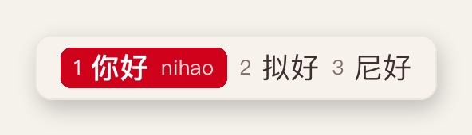
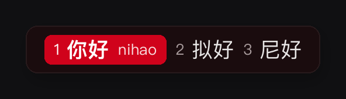
</p>

<h3 id="emerald">エメラルド · <code>#009473</code></h3>

ニュートラルな紙。緑は選択チップだけ。

```yaml
style/color_scheme: xxd_emerald
style/color_scheme_dark: xxd_emerald_night
```

<p>
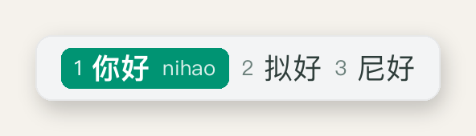
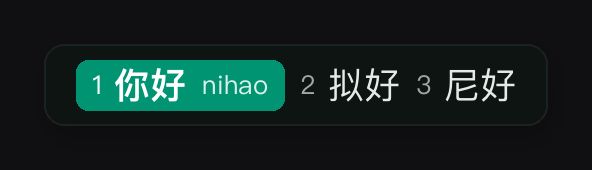
</p>

<h3 id="coral">リビングコーラル · <code>#FF6F61</code></h3>

2019年のカラー。原色チップにテラコッタ文字。白文字は沈む。

```yaml
style/color_scheme: xxd_coral
style/color_scheme_dark: xxd_coral_night
```

<p>
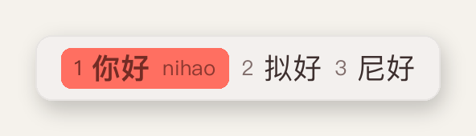
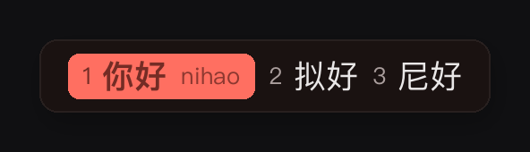
</p>

<h3 id="ultraviolet">ウルトラバイオレット · <code>#5F4B8B</code></h3>

2018年のカラー。ナイトの地はプラムブラック。

```yaml
style/color_scheme: xxd_ultraviolet
style/color_scheme_dark: xxd_ultraviolet_night
```

<p>
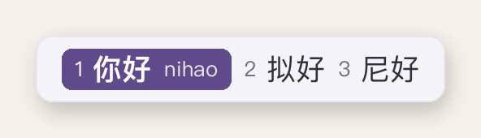

</p>

<h3 id="classic_blue">クラシックブルー · <code>#0F4C81</code></h3>

2020年のカラー。ネイビーチップに白文字。

```yaml
style/color_scheme: xxd_classic_blue
style/color_scheme_dark: xxd_classic_blue_night
```

<p>

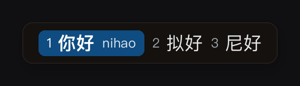
</p>

<h3 id="peri">ベリーペリ · <code>#6667AB</code></h3>

2022年のカラー。グレー寄りの紫青。

```yaml
style/color_scheme: xxd_peri
style/color_scheme_dark: xxd_peri_night
```

<p>
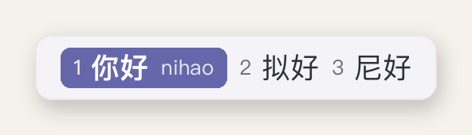
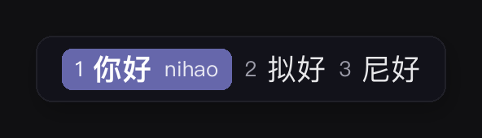
</p>

<h3 id="royal">ロイヤルブルー · <code>#4169E1</code></h3>

原色チップをニュートラルグレー紙に。ベビーブルーの地は使わない。

```yaml
style/color_scheme: xxd_royal
style/color_scheme_dark: xxd_royal_night
```

<p>


</p>

<h3 id="chartreuse">シャルトリューズ · <code>#DFFF00</code></h3>

ネオンは白紙に沈むので、ライトはカーキバーで原色を支える。

```yaml
style/color_scheme: xxd_chartreuse
style/color_scheme_dark: xxd_chartreuse_night
```

<p>
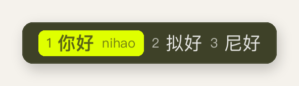
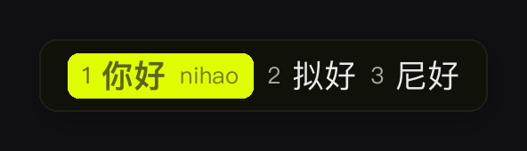
</p>

<h3 id="millennial">ミレニアルピンク · <code>#F3C6C8</code></h3>

ライトはblush紙の上の淡いピンク。ナイトがピンクの灯。

```yaml
style/color_scheme: xxd_millennial
style/color_scheme_dark: xxd_millennial_night
```

<p>
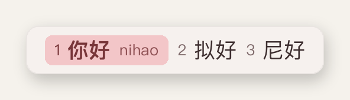
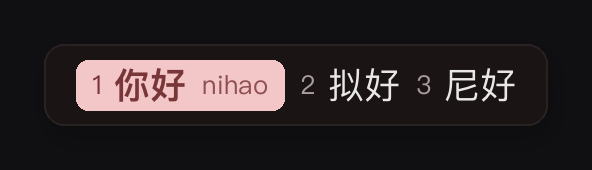
</p>

## 手動インストール

鼠鬚管が読むのは `~/Library/Rime/squirrel.custom.yaml` だけです。`xxd_*` を **このファイルへコピー**してください。シンボリックリンクも `__include` も使わないでください。

### macOS · 鼠鬚管

1. メニューバーの鼠鬚管アイコン → **ユーザ設定…** で `~/Library/Rime/` を開く。`squirrel.custom.yaml` が無ければ新規作成し、ルートは `patch:`。
2. 本リポジトリの [`schemes/xxd.squirrel.yaml`](schemes/xxd.squirrel.yaml) を開く。
3. `preset_color_schemes:` 下の `xxd_*` をコピー。1セットなら浅色+夜色のペア（例 `xxd_tiffany` と `xxd_tiffany_night`）。複数ならペアごと。全部ならすべての `xxd_*`。
4. `squirrel.custom.yaml` の `patch:` → `preset_color_schemes:` に貼る。**既存の他スキンと app_options は残す。**
5. `patch:` 下に使用中のペアを書く：

```yaml
patch:
  style/color_scheme: xxd_tiffany
  style/color_scheme_dark: xxd_tiffany_night
```

6. 鼠鬚管メニュー → **再デプロイ**。システムのライト/ダークでこのペアが切り替わります。変更は下表のキーに合わせてください。

### Windows · 小狼毫

手順は同じ。ファイルは `%APPDATA%\Rime\weasel.custom.yaml`、配色は [`schemes/xxd.weasel.yaml`](schemes/xxd.weasel.yaml)（色は BGR のまま）。小狼毫メニューから再デプロイ。

## AI に頼むときのコピペ文

下のブロックをそのまま Cursor / Claude / ChatGPT / Grok に貼ってください。名前と `xxd_` キーは欲しいセットに変える。**シンボリックリンクと `__include` は禁止。**

### 全部入れてティファニーを有効化

```
https://github.com/nevertoday/rime-color-scheme から macOS 鼠鬚管へ XXD 配色をすべて入れてください。
シンボリックリンク禁止。__include 禁止。
schemes/xxd.squirrel.yaml の xxd_* をすべて ~/Library/Rime/squirrel.custom.yaml の patch.preset_color_schemes にマージ。
既存の他スキン、app_options、他の patch キーは残す。
設定：
style/color_scheme: xxd_tiffany
style/color_scheme_dark: xxd_tiffany_night
その後：
"/Library/Input Methods/Squirrel.app/Contents/MacOS/Squirrel" --reload
完了後、書いた xxd_ キーを列挙。
```

### 1セットだけ（名前とキーを変える）

```
macOS 鼠鬚管に XXD 配色「ティファニーブルー」だけ入れてください。
リポジトリ：https://github.com/nevertoday/rime-color-scheme
schemes/xxd.squirrel.yaml の xxd_tiffany と xxd_tiffany_night だけを ~/Library/Rime/squirrel.custom.yaml の preset_color_schemes に書く。
シンボリックリンク禁止、__include 禁止、既存の他配色は削除しない。
有効化：
style/color_scheme: xxd_tiffany
style/color_scheme_dark: xxd_tiffany_night
その後 Squirrel --reload。
```

### 複数入れて、そのうち1つを有効化

```
https://github.com/nevertoday/rime-color-scheme の schemes/xxd.squirrel.yaml から
次を ~/Library/Rime/squirrel.custom.yaml にコピー：
xxd_hermes, xxd_hermes_night, xxd_klein, xxd_klein_night, xxd_chanel, xxd_chanel_night
エルメスを有効化：
style/color_scheme: xxd_hermes
style/color_scheme_dark: xxd_hermes_night
シンボリックリンク禁止、__include 禁止、他設定は残す。鼠鬚管をデプロイ：
"/Library/Input Methods/Squirrel.app/Contents/MacOS/Squirrel" --reload
```

### もう入っている。使うセットだけ変える

```
~/Library/Rime/squirrel.custom.yaml にはすでに xxd_* があります。
使用中だけクラインブルーに変えてください：
style/color_scheme: xxd_klein
style/color_scheme_dark: xxd_klein_night
その後 Squirrel --reload。preset_color_schemes は触らない。シンボリックリンク禁止。
```

## セットを変える

| 名前 | チップ | ライト | ナイト |
| --- | --- | --- | --- |
| [ティファニーブルー](#tiffany) | `#81D8D0` | `xxd_tiffany` | `xxd_tiffany_night` |
| [エルメスオレンジ](#hermes) | `#F37021` | `xxd_hermes` | `xxd_hermes_night` |
| [クラインブルー](#klein) | `#002FA7` | `xxd_klein` | `xxd_klein_night` |
| [サブマリーナーグリーン](#rolex) | `#006039` | `xxd_rolex` | `xxd_rolex_night` |
| [フェラーリレッド](#ferrari) | `#FF2800` | `xxd_ferrari` | `xxd_ferrari_night` |
| [バービーピンク](#barbie) | `#DA1884` | `xxd_barbie` | `xxd_barbie_night` |
| [コカ・コーラレッド](#coke) | `#F40009` | `xxd_coke` | `xxd_coke_night` |
| [スターバックスグリーン](#starbucks) | `#00704A` | `xxd_starbucks` | `xxd_starbucks_night` |
| [イケアブルー](#ikea_blue) | `#0058A3` | `xxd_ikea_blue` | `xxd_ikea_blue_night` |
| [イケアイエロー](#ikea_yellow) | `#FFDA1A` | `xxd_ikea_yellow` | `xxd_ikea_yellow_night` |
| [シャネルブラック](#chanel) | `#000000` | `xxd_chanel` | `xxd_chanel_night` |
| [カルティエレッド](#cartier) | `#D0021B` | `xxd_cartier` | `xxd_cartier_night` |
| [エメラルド](#emerald) | `#009473` | `xxd_emerald` | `xxd_emerald_night` |
| [リビングコーラル](#coral) | `#FF6F61` | `xxd_coral` | `xxd_coral_night` |
| [ウルトラバイオレット](#ultraviolet) | `#5F4B8B` | `xxd_ultraviolet` | `xxd_ultraviolet_night` |
| [クラシックブルー](#classic_blue) | `#0F4C81` | `xxd_classic_blue` | `xxd_classic_blue_night` |
| [ベリーペリ](#peri) | `#6667AB` | `xxd_peri` | `xxd_peri_night` |
| [ロイヤルブルー](#royal) | `#4169E1` | `xxd_royal` | `xxd_royal_night` |
| [シャルトリューズ](#chartreuse) | `#DFFF00` | `xxd_chartreuse` | `xxd_chartreuse_night` |
| [ミレニアルピンク](#millennial) | `#F3C6C8` | `xxd_millennial` | `xxd_millennial_night` |

## このリポジトリの役割

ここは配色パックとプレビューです。実際に効くのは手元の `squirrel.custom.yaml` です。ここを直したら、ユーザーディレクトリへコピーし直してデプロイしてください。

イケアイエローとシャルトリューズは白紙に沈むので、ライトはネイビー / カーキのバーで原色チップを支えます。シャネルのナイトはチャコールバー + 黒チップ + アイボリー文字。文字色：暗いチップは白、浅いチップは同系のインク（ティファニー `#0A7680`、コーラル `#742C25`、ミレニアル `#783639`）。

プレビューは `python3 scripts/render_previews.py` が YAML から生成します。手描きしないでください。

## 免責

色は公開されているシグネチャーカラーと一般的なデジタル近似です。個人の IME テーマ用です。**各ブランドとの所属・許諾関係はありません。** 名前は色を識別するためだけです。

## License

[MIT](LICENSE)
